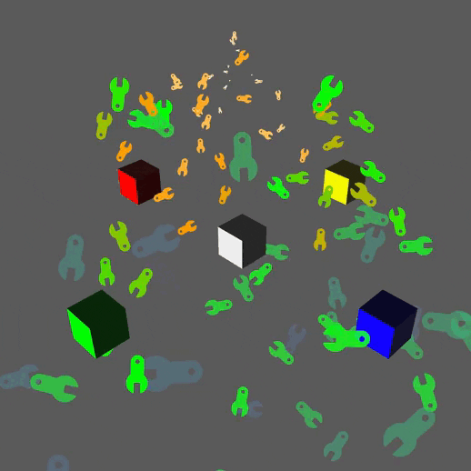
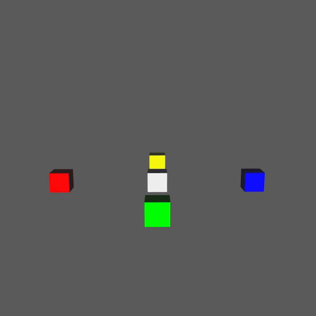

<!-- cargo-sync-readme start -->

# Bevy Tickles

[](https://github.com/ManevilleF/bevy_tickles/actions/workflows/rust.yml)

[](./LICENSE)
[](https://github.com/rust-secure-code/safety-dance/)

Particle systems plugin for [bevy](https://bevyengine.org) inspired by `Unity3D` *shuriken* particle system

> This is a work in progress with many missing features, it is not suitable for production.
> As this lib is in very early stage, expect the API to change often

<!-- cargo-sync-readme end -->

## Usage

Add `ParticlesPlugin` to your bevy `App`

```rust
use bevy::prelude::*;
use bevy_particles::prelude::*;

fn main() {
    App::new()
        .add_plugins(DefaultPlugins)
        .add_plugin(ParticlesPlugin)
        .run();
}
```

You can then use `ParticleSystemBundle` to spawn particle systems.

> Note: The particle modifiers are not included in the bundle, `insert` the modifiers you want to the particle system entity. (See the [example](examples/basic_example.rs))

### Components

*bevy_tickles* provides two kinds of components:
- The *Main Components* which are part of the `ParticleSystemBundle`
- The *modifiers* which are optional effects on the particles or the entire system

#### Built-in modifiers

| name | description |
|------|-------------|
|`MaxParticleCount` | Limits the amount of particles (**PERF**) |
|`MaxParticleSize`  | Limits the size of particles |
|`MaxParticleSpeed` | Limits the speed of particles|
|`ParticleGravity`  | Adds a custom gravity force to particles |
|`SpeedOverTime`  | Changes particle speed over time |
|`VelocityOverTime` | Changes particle velocity over time |
|`AngularVelocityOverTime`  | Changes particle angular velocity (`z` rotation) over time |
|`OrbitalVelocityOverLifeTime` | Changes the particle velocity around the center over its lifetime |
|`LinearVelocityOverLifeTime` | Changes the particle velocity linearly over its lifetime |
|`SizeOverTime` | Changes particle size over time |
|`SizeOverSpeed`  | Changes particle size over its speed |
|`RotationOverVelocity` | Rotates particles according to its velocity and direction |
|`RotationOverTime` | Rotates particles over time |
|`ColorOverLifeTime`  | **Sets** color of a particle over time using a color gradient |
|`ColorOverSpeed`  | **Sets** color of a particle over its using a color gradient |
|`PerlinNoise`  | Uses a perlin noise to change particle velocity/Size/Rotation |

## Common mistakes

- Rotating and scaling the particle system entity's `Transform` is often a bad idea, prefer using the `ParticleEmitter::transform` field.
- Using conflicting modifers like `ColorOverLifetime`/`ColorOverSpeed` or `SizeOverTime`/`SizeOverSpeed` can lead to unexpected behaviors

## Cargo Features

1. `inspector`

This feature enables [bevy_inspector_egui](https://github.com/jakobhellermann/bevy-inspector-egui) integration, allowing dynamic customization of your particle systems

## Examples

1. [Basic example](examples/basic_example.rs)

Run with `cargo run --example basic_example --features inspector`



2. [Animated example](examples/animated_example.rs)

Run with `cargo run --example animated_example --features inspector`


3. [Explosion example](examples/explosion_example.rs)

Run with `cargo run --example explosion_example --features inspector`



## TODO:

- [x] computed visibility with AAB
- [x] Duration/Looping/Infinite particle emission
- [ ] Curves and gradients implementation
- [ ] Complete modifier list
- [ ] Sub Emitters and callbacks (trails/death)
- [ ] Curves
- [x] Color gradients
- [ ] Multi camera support
- [ ] Lit particles
- [x] Perlin noise
- [ ] Uniform random emission
- [ ] examples of classic particle systems:
  - [ ] Fire
  - [x] Explosion
  - [ ] Sci Fi Shield

Contributions welcome !